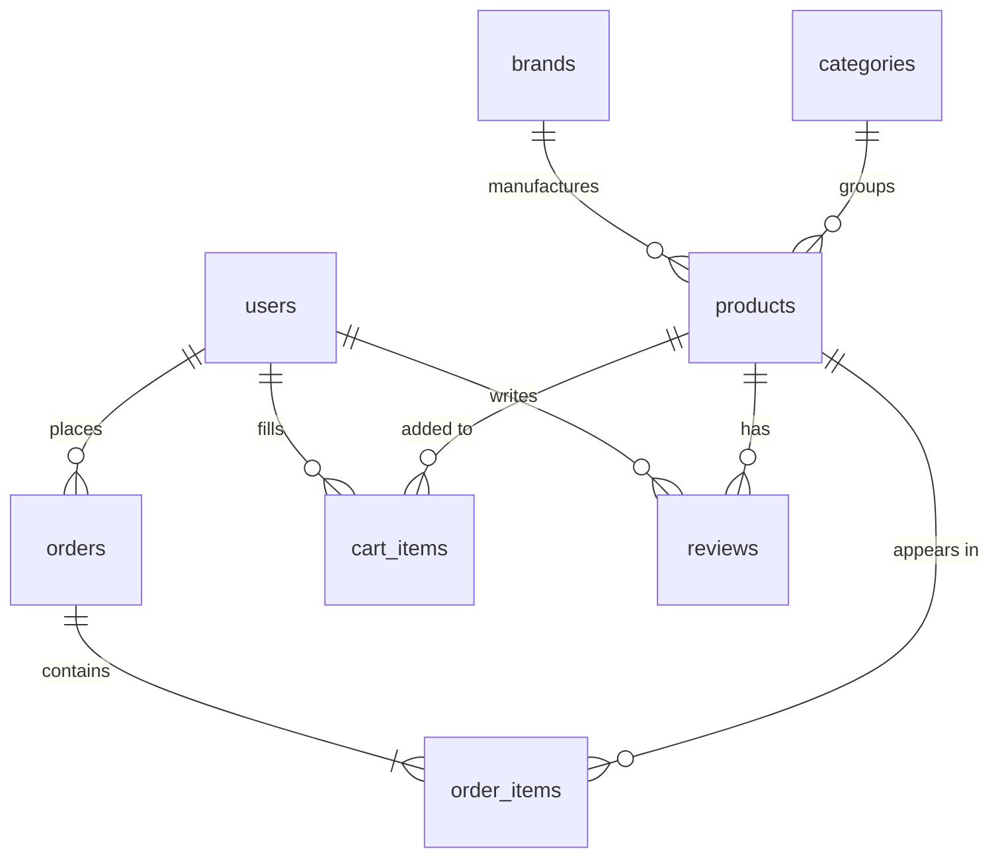

[🇷🇺 Русский](README.md) · 🇬🇧 English

# Online pharmacy on Laravel with an AI consultant running on a local LLM (Ollama + Qwen3)

A migration of my diploma project from procedural PHP to Laravel. The functionality is the same — storefront, cart, payments, admin panel, AI consultant — but the code is split across the framework's layers, and several problems from the original version got fixed along the way.


> ⚠️ **Student project.** The AI consultant is not a medical professional and does not replace a doctor or a pharmacist. Its answers must not be used for self-diagnosis or for choosing treatment. It never recommends prescription-only drugs — when one matches the symptom, it points the user to a doctor instead.

> 📦 **The previous version** written in procedural PHP is pinned under the [`v1-procedural`](../../releases/tag/v1-procedural) tag and lives in the `main` branch. It still works, runs through Docker, and has its own README.

## What changed in the migration

The original was 5,410 lines across 32 files, where every `.php` file in `public/` included `bootstrap.php` itself, talked to the database through a global `$pdo`, and rendered its own HTML. Here the same thing is split into layers: route → controller → service → model → Blade.

| Before | After |
|---|---|
| `app/bootstrap.php` | `bootstrap/app.php` + middleware |
| `app/config.example.php` | `.env` + `config/pharmacy.php` |
| `isLogged()`, `isAdmin()`, `requireAdmin()` | `auth` and `admin` middleware |
| `csrfToken()`, `csrfField()`, `checkCsrf()` | the `@csrf` directive |
| `imgUrl()` | the `Product::$image_url` accessor |
| `getProductLabels()`, `getLabelText()` | `Product::LABELS`, `Product::LABEL_TEXTS` constants |
| `updateUserOrderStatuses()` in bootstrap | the scheduled `php artisan orders:advance` command |
| `index.php` (868 lines) | `CatalogController` + `catalog/index.blade.php` |
| `chat_api.php` | `AiConsultantController` + `OllamaConsultant` |
| `cart.php` (POST branch) | `CheckoutController` + `CheckoutService` |
| `register.php` (three branches in one file) | `RegisterController` + `EmailVerificationService` |
| `admin/product_*.php` | `Admin\ProductController` (resource routes) |
| manual limits in `$_SESSION` | `RateLimiter` |

### What got fixed along the way

None of this is cosmetic — every item was a real problem in the original version.

**Stock was never decremented.** The old code had no `UPDATE products SET stock = stock - ?` anywhere. A product with `stock = 1` could be ordered in any quantity, as many times as you liked. Now the decrement happens inside `CheckoutService` in a transaction with `lockForUpdate()`, and cancelling an order returns the stock.

**Adding to the cart worked over GET with no CSRF token.** Any `` on a third-party page filled up a user's cart. It's a POST request now.

**The entire catalog went into the LLM prompt** — this was already on the original version's own list of unfinished work. The prompt is now built from a keyword-based subset of the catalog, with the limit set in config.

**Prescription drugs were filtered after the fact.** The model saw them in the list, recommended them, and only then did PHP strip the product card from the response — while the name stayed in the answer text. Now the `overTheCounter()` scope runs before anything reaches the model.

**Email confirmation codes were stored in plain text.** They're hashed now.

**Login had no attempt limit** — passwords could be brute-forced indefinitely. Now `RateLimiter` allows 5 attempts per IP + email pair.

**The catalog loaded in full with no pagination** — another item from the old list. Now `paginate(24)`.

**`updateUserOrderStatuses()` ran on every request** from a logged-in user: one SELECT plus a batch of UPDATEs whenever anyone loaded an image. It's a background command running once a minute now.

## The AI consultant

The core idea is unchanged: the model is not a source of data, it only picks names, and every fact is pulled from the database. The plumbing moved into `app/Services/OllamaConsultant.php`.

The main difference from the old version is that the catalog no longer goes into the prompt whole. Words longer than four characters are extracted from the user's question, matched against product names, indications and short descriptions, and topped up to the limit with a plain query:

```php
private function catalogForPrompt(string $question): Collection
{
    $limit = config('pharmacy.ollama.catalog_limit');

    $keywords = collect(preg_split('/\s+/u', mb_strtolower($question)))
        ->filter(fn ($w) => mb_strlen($w) >= 4)
        ->take(6);

    $relevant = Product::query()
        ->overTheCounter()   // prescription drugs never enter the prompt
        ->available()
        ->where(function ($q) use ($keywords) {
            foreach ($keywords as $word) {
                $q->orWhere('name', 'like', "%{$word}%")
                  ->orWhere('indications', 'like', "%{$word}%")
                  ->orWhere('short_description', 'like', "%{$word}%");
            }
        })
        ->limit($limit)
        ->get();

    // ... top up to the limit
}
```

The request goes out through Laravel's Http client instead of hand-rolled curl, with a timeout and logging. If Ollama is unreachable, `OllamaUnavailableException` is thrown, and the controller returns a 503 with a readable message instead of a blank screen.

Parsing the reply lives in a public `splitAnswer()` method — separate from network and database calls, so it can be covered by a test without spinning up Ollama.

### Consultant safeguards

- **The prescription filter** is now double: such products never enter the prompt, and they're stripped from the response as well.
- **A disclaimer** is attached to every answer.
- **Rate limiting** goes through `RateLimiter`, keyed by user or IP rather than by session — clearing cookies no longer bypasses it.
- **CSRF** is handled automatically by the `web` middleware group.
- Question length is capped at 500 characters by validation.

## Stack

Laravel 13 on PHP 8.2+, Blade for templates, Vite for bundling CSS and JS, Bootstrap 5 installed locally as a package rather than pulled from a CDN. The database is SQLite out of the box; switching to MySQL/MariaDB takes two lines in `.env`.

Database access goes through Eloquent. Business logic lives in services:

```
app/Services/
├── OllamaConsultant.php          drug matching through the local LLM
├── YooKassaClient.php            creating payments, checking status
├── CheckoutService.php           order placement, transaction, stock decrement
├── CartService.php               cart
└── EmailVerificationService.php  email confirmation codes
```

The storefront, cart, checkout, YooKassa payments, personal account, brand pages and admin panel are all there. Order statuses are unchanged: `new` → `processing` → `shipped` → `at_hub` → `sent_to_pickup` → `ready_for_pickup`, plus `pending_payment`, `paid`, `delivered` and `cancelled` on the side. The demo progression through that chain is configured in `config/pharmacy.php` and switched off with `ORDER_SIMULATION_ENABLED`.

### Security

- Eloquent and the query builder parameterise everything; there is no hand-concatenated SQL in the project.
- Passwords use bcrypt via the `'password' => 'hashed'` cast. Hashes from the old database carry over as-is, so existing passwords keep working.
- CSRF protection applies to every POST request automatically through the `web` middleware group.
- Uploaded images are checked with the `image|mimes:...` rule, which inspects the real file type.
- Checkout runs in a transaction with `lockForUpdate()` on the product rows.
- The payment URL is validated against a host allowlist from config.
- Logging out is a POST request, not a GET link.

## Running it

You need PHP 8.2+, Composer and Node.js. The database defaults to SQLite, so MySQL is optional. Ollama stays on the host: the `qwen3:8b` model is around 5 GB.

```bash
git clone -b laravel https://github.com/strashilka2006/pharmacy-ai-assistant.git apteka
cd apteka

composer install
npm install
cp .env.example .env
php artisan key:generate
```

For a quick start, this is all you need in `.env`:

```ini
DB_CONNECTION=sqlite

# emails are written to storage/logs/laravel.log instead of being sent over SMTP
MAIL_MAILER=log
# the queue runs inline, no separate worker needed
QUEUE_CONNECTION=sync

OLLAMA_URL=http://localhost:11434/api/chat
OLLAMA_MODEL=qwen3:8b
```

Then:

```bash
touch database/database.sqlite
php artisan migrate
php artisan storage:link
npm run build
php artisan serve
```

The site comes up at `http://127.0.0.1:8000`.

### Data and images

The catalog from the old dump is loaded by a seeder — 15 products and 4 brands:

```bash
php artisan db:seed --class=LegacyDataSeeder
```

Product and brand images aren't committed to this branch (Laravel ignores the contents of `storage/app/public`). The `install-images.ps1` script pulls them straight from the `main` branch on GitHub:

```powershell
Set-ExecutionPolicy -Scope Process -ExecutionPolicy Bypass -Force
.\install-images.ps1
```

Creating an administrator:

```bash
php artisan tinker
```
```php
App\Models\User::create([
    'email' => 'admin@apteka.local',
    'password' => 'change-this',
    'name' => 'Admin',
    'role' => 'admin',
]);
```

### Switching to MySQL

```ini
DB_CONNECTION=mysql
DB_HOST=127.0.0.1
DB_DATABASE=apteka
DB_USERNAME=root
DB_PASSWORD=
```

Then run `php artisan migrate:fresh` and the seeder again. To move data from the full MySQL dump of the old version, `migration-tools/import-legacy-data.sql` maps the old tables onto the new schema.

### Background tasks

Demo order progression, and mail delivery if the queue isn't set to `sync`:

```bash
php artisan schedule:work
php artisan queue:work
```

## Database structure

DBMS: SQLite or MySQL/MariaDB · Tables: 12

The schema closely follows the old one, with a few changes:

- `cart` was renamed to `cart_items`, gained `timestamps` and a unique index on `(user_id, product_id)` — there was no such index before, so the same product could sit in one cart as several rows.
- `email_verifications.code` became `code_hash`.
- `photo` (never used anywhere) and `brand` (a text duplicate of `brand_id`) were dropped from `products`.
- `permissions` and `role_permissions` were not carried over: both were empty and never referenced in the code.
- `coupons`, `used_coupons` and `admin_logs` were moved into a separate migration file — they're unused too, but kept so the old dump imports without losses. Delete that one file if you don't need them.



Deletion rules are declared in the migrations and mirror the old schema: `cascadeOnDelete()` for a user's cart, orders and reviews, `restrictOnDelete()` for products referenced by `order_items` (you can't delete a product that sits in someone's purchase history), and `nullOnDelete()` for brands and categories.

<details>
<summary>Project structure</summary>

```text
apteka/
├── app/
│   ├── Console/Commands/
│   │   └── AdvanceOrderStatuses.php     demo order status progression
│   ├── Http/
│   │   ├── Controllers/
│   │   │   ├── Admin/                   admin panel
│   │   │   │   ├── DashboardController.php
│   │   │   │   ├── ProductController.php
│   │   │   │   └── BrandController.php
│   │   │   ├── Auth/
│   │   │   │   ├── LoginController.php    login and logout
│   │   │   │   └── RegisterController.php signup, email codes
│   │   │   ├── AiConsultantController.php AI chat endpoint
│   │   │   ├── CatalogController.php      home page and AJAX catalog
│   │   │   ├── ProductController.php      product page
│   │   │   ├── BrandController.php        brand page
│   │   │   ├── CartController.php         cart
│   │   │   ├── CheckoutController.php     order placement
│   │   │   ├── PaymentController.php      payment and YooKassa return
│   │   │   ├── OrderController.php        viewing and cancelling orders
│   │   │   └── ProfileController.php      personal account
│   │   ├── Middleware/
│   │   │   └── EnsureUserIsAdmin.php     role check
│   │   └── Requests/                     form validation
│   ├── Mail/
│   │   └── VerificationCodeMail.php      confirmation code email
│   ├── Models/                           Eloquent models and relations
│   ├── Providers/
│   │   └── AppServiceProvider.php        rate limiters
│   └── Services/                         business logic
├── config/
│   └── pharmacy.php                      Ollama, YooKassa, delivery simulation
├── database/
│   ├── migrations/                       9 migrations
│   └── seeders/
│       ├── LegacyDataSeeder.php          loads the old catalog
│       └── legacy-data.json              data extracted from schema.sql
├── migration-tools/
│   ├── import-legacy-data.sql            porting the full MySQL dump
│   └── move-uploads.sh                   sorting old uploads onto disks
├── resources/
│   ├── css/
│   │   ├── app.css                       Bootstrap + chat and slider styles
│   │   └── legacy.css                    the old style.css in full
│   ├── js/
│   │   ├── ai-chat.js                    consultant widget
│   │   ├── cart.js                       quantity buttons
│   │   └── catalog.js                    brand slider, AJAX filters
│   └── views/                            Blade templates
├── routes/
│   ├── web.php                           all routes
│   └── console.php                       schedule
└── install-images.ps1                    downloads images from the main branch
```
</details>

## What's unfinished / what could be added

**The YooKassa webhook.** Just like in the old version, payment status is only checked when the user comes back to the site. Close the tab and the order sits in `pending_payment` forever. This needs a POST route for notifications with signature verification.

**Reviews.** The table, model and relations exist; the interface doesn't — same as in the original.

**Categories.** They're in the database and `products.category_id` is populated, but nothing in the interface uses them. The dump contains no categories at all, so related products are matched by brand and price.

**Some templates weren't ported one-to-one.** The home page (hero, brand marquee, slider, AI widget, filter bar, product cards) is copied from the original markup as-is. The product, brand, profile and privacy pages were rebuilt from scratch — they work, but they look different. Inline `<style>` blocks from the old pages were only partially carried over.

**There are no tests.** The most worthwhile things to cover are `CheckoutService` (stock decrement, rollback on a failed payment) and `OllamaConsultant::splitAnswer()`, which was deliberately made public and dependency-free for exactly that.

**The consultant has no conversation history**, every question is handled in isolation.

**The name block is still parsed with a regex.** Ollama supports `format: json`, which would have been the right way.

**Google and VK sign-in** weren't ported — they had already been removed from the forms in the old version for the same reasons.

## Notes for anyone deploying this

Everything the `main` branch README says about YooKassa, the Google API and OpenRouter still applies — the keys and the approach haven't changed, only where you put them: `.env` instead of `app/config.php`.

One thing specific to Laravel: the web server's document root must point at the `public/` folder. On shared hosting like Beget that's a setting in the control panel, not something you fix with an `.htaccess` in the project root.

If you're deploying somewhere without CDN access — Bootstrap and its icons are already installed locally through npm, and there are no jsdelivr links left in the templates. The Inter and Fragment Mono fonts are still loaded from Google Fonts; if that's unreachable, text falls back to a system font.

---

If you're going to read the code: the sensible starting points are `app/Services/OllamaConsultant.php`, which holds all the AI consultant logic, and `app/Services/CheckoutService.php`, which handles order placement inside a transaction. The rest is a fairly ordinary online store.
