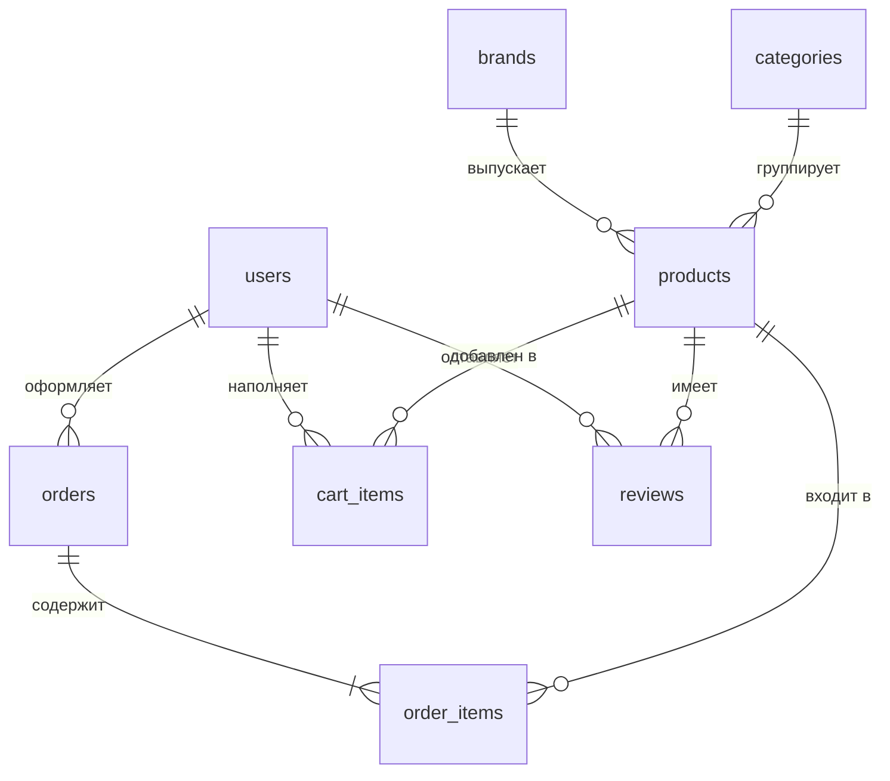

<p align="center"><a href="https://laravel.com" target="_blank"></a></p>

<p align="center">
<a href="https://github.com/laravel/framework/actions"></a>
<a href="https://packagist.org/packages/laravel/framework"></a>
<a href="https://packagist.org/packages/laravel/framework"></a>
<a href="https://packagist.org/packages/laravel/framework"></a>
</p>

🇷🇺 Русский

# Интернет-аптека на Laravel с ИИ-консультантом на локальной LLM (Ollama + Qwen3)

Перенос дипломного проекта с процедурного PHP на Laravel. Функциональность та же — витрина, корзина, оплата, админка, ИИ-консультант, — но код разложен по слоям фреймворка, а часть проблем исходной версии закрыта по дороге.


> ⚠️ **Учебный проект.** ИИ-консультант не является медицинским работником и не заменяет консультацию врача или фармацевта. Его ответы нельзя использовать для самодиагностики или подбора лечения. Рецептурные препараты консультант к покупке не предлагает — при совпадении по симптому он направляет к врачу.

> 📦 **Предыдущая версия** на процедурном PHP зафиксирована тегом [`v1-procedural`](../../releases/tag/v1-procedural) и лежит в ветке `main`. Она рабочая, разворачивается через Docker и описана в своём README.

## Что изменилось при переносе

Исходная версия — 5410 строк в 32 файлах, где каждый `.php` в `public/` сам подключал `bootstrap.php`, сам ходил в базу через глобальный `$pdo` и сам рендерил HTML. Здесь то же самое разложено по слоям: маршрут → контроллер → сервис → модель → Blade.

| Было | Стало |
|---|---|
| `app/bootstrap.php` | `bootstrap/app.php` + middleware |
| `app/config.example.php` | `.env` + `config/pharmacy.php` |
| `isLogged()`, `isAdmin()`, `requireAdmin()` | middleware `auth` и `admin` |
| `csrfToken()`, `csrfField()`, `checkCsrf()` | директива `@csrf` |
| `imgUrl()` | аксессор `Product::$image_url` |
| `getProductLabels()`, `getLabelText()` | константы `Product::LABELS`, `Product::LABEL_TEXTS` |
| `updateUserOrderStatuses()` в bootstrap | команда `php artisan orders:advance` по расписанию |
| `index.php` (868 строк) | `CatalogController` + `catalog/index.blade.php` |
| `chat_api.php` | `AiConsultantController` + `OllamaConsultant` |
| `cart.php` (POST-ветка) | `CheckoutController` + `CheckoutService` |
| `register.php` (3 ветки в одном файле) | `RegisterController` + `EmailVerificationService` |
| `admin/product_*.php` | `Admin\ProductController` (resource-маршруты) |
| ручные лимиты в `$_SESSION` | `RateLimiter` |

### Что починилось по дороге

Это не косметика — каждый пункт был реальной проблемой исходной версии.

**Остатки на складе не списывались.** В старом коде нигде не было `UPDATE products SET stock = stock - ?`. Товар с `stock = 1` можно было заказать в любом количестве, сколько угодно раз. Теперь списание идёт в `CheckoutService` внутри транзакции с `lockForUpdate()`, при отмене заказа остатки возвращаются.

**Добавление в корзину работало по GET без CSRF.** Любая картинка `` на стороннем ресурсе набивала пользователю корзину. Теперь POST с токеном.

**Весь каталог уезжал в промпт LLM** — это было в списке «что не доделал» исходной версии. Теперь промпт собирается из выборки по ключевым словам вопроса, лимит задаётся в конфиге.

**Рецептурные препараты фильтровались постфактум.** Модель видела их в списке, рекомендовала, и только потом PHP вырезал карточку из выдачи — а название оставалось в тексте ответа. Теперь фильтр `overTheCounter()` стоит до отправки в модель.

**Коды подтверждения почты лежали открытым текстом.** Теперь хешируются.

**У входа не было лимита попыток** — пароль перебирался без ограничений. Теперь `RateLimiter`, 5 попыток на пару IP + email.

**Каталог грузился целиком без пагинации** — тоже пункт из старого списка недоделок. Теперь `paginate(24)`.

**`updateUserOrderStatuses()` дёргалась на каждом запросе** залогиненного пользователя: SELECT плюс пачка UPDATE при загрузке любой картинки. Теперь это фоновая команда раз в минуту.

## ИИ-консультант

Логика осталась той же: модель не является источником данных, она только выбирает названия, а все факты подтягиваются из базы. Но обвязка переехала в сервис `app/Services/OllamaConsultant.php`.

Главное отличие от старой версии — каталог в промпт уходит не целиком. Из вопроса пользователя вытаскиваются слова длиннее четырёх символов, по ним идёт поиск в названиях, показаниях и кратких описаниях, и добор до лимита обычной выборкой:

```php
private function catalogForPrompt(string $question): Collection
{
    $limit = config('pharmacy.ollama.catalog_limit');

    $keywords = collect(preg_split('/\s+/u', mb_strtolower($question)))
        ->filter(fn ($w) => mb_strlen($w) >= 4)
        ->take(6);

    $relevant = Product::query()
        ->overTheCounter()   // рецептурные не попадают в промпт вообще
        ->available()
        ->where(function ($q) use ($keywords) {
            foreach ($keywords as $word) {
                $q->orWhere('name', 'like', "%{$word}%")
                  ->orWhere('indications', 'like', "%{$word}%")
                  ->orWhere('short_description', 'like', "%{$word}%");
            }
        })
        ->limit($limit)
        ->get();

    // ... добор до лимита
}
```

Запрос уходит через Http-клиент Laravel вместо ручного curl, с таймаутом и логированием. Недоступность Ollama выбрасывает `OllamaUnavailableException`, контроллер отдаёт 503 и понятное сообщение вместо пустого экрана.

Разбор ответа вынесен в публичный метод `splitAnswer()` — отдельно от запросов к сети и базе, так что его можно покрыть тестом без поднятия Ollama.

### Ограничения консультанта

- **Фильтр рецептурных** — теперь двойной: такие товары не попадают в промпт и отсеиваются в ответе.
- **Дисклеймер** добавляется к каждому ответу.
- **Ограничение частоты** через `RateLimiter` с привязкой к пользователю или IP, а не к сессии — очисткой кук больше не обходится.
- **CSRF** проверяется middleware-группой `web` автоматически.
- Длина вопроса ограничена валидацией на 500 символов.

## Стек

Laravel 13 на PHP 8.2+, Blade для шаблонов, Vite для сборки CSS и JS, Bootstrap 5 подключён локально пакетом, а не с CDN. База — SQLite из коробки, MySQL/MariaDB переключается двумя строками в `.env`.

Взаимодействие с базой — Eloquent. Бизнес-логика вынесена в сервисы:

```
app/Services/
├── OllamaConsultant.php          подбор препаратов через локальную LLM
├── YooKassaClient.php            создание платежа, проверка статуса
├── CheckoutService.php           оформление заказа, транзакция, списание остатков
├── CartService.php               корзина
└── EmailVerificationService.php  коды подтверждения почты
```

Витрина, корзина, оформление заказа, оплата через ЮKassa, личный кабинет, страницы брендов и админка — всё на месте. Статусы заказа те же: `new` → `processing` → `shipped` → `at_hub` → `sent_to_pickup` → `ready_for_pickup`, плюс отдельно `pending_payment`, `paid`, `delivered`, `cancelled`. Демо-продвижение по цепочке настраивается в `config/pharmacy.php` и выключается переменной `ORDER_SIMULATION_ENABLED`.

### Безопасность

- Eloquent и Query Builder параметризуют запросы, ручной конкатенации SQL в проекте нет.
- Пароли — bcrypt через каст `'password' => 'hashed'`. Хеши из старой базы переносятся как есть, старые пароли продолжают работать.
- CSRF на всех POST-запросах автоматически, middleware-группой `web`.
- Загружаемые изображения проверяются правилом `image|mimes:...`, которое смотрит на реальный тип файла.
- Оформление заказа — транзакция с `lockForUpdate()` на строках товаров.
- Ссылка на оплату проверяется по белому списку хостов из конфига.
- Выход из аккаунта — POST, а не GET-ссылка.

## Запуск

Нужен PHP 8.2+, Composer и Node.js. База по умолчанию SQLite — MySQL ставить не обязательно. Ollama остаётся на хосте: модель `qwen3:8b` весит около 5 ГБ.

```bash
git clone -b laravel https://github.com/strashilka2006/pharmacy-ai-assistant.git apteka
cd apteka

composer install
npm install
cp .env.example .env
php artisan key:generate
```

В `.env` для быстрого старта достаточно этого:

```ini
DB_CONNECTION=sqlite

# письма пишутся в storage/logs/laravel.log вместо отправки по SMTP
MAIL_MAILER=log
# очередь выполняется сразу, отдельный воркер не нужен
QUEUE_CONNECTION=sync

OLLAMA_URL=http://localhost:11434/api/chat
OLLAMA_MODEL=qwen3:8b
```

Дальше:

```bash
touch database/database.sqlite
php artisan migrate
php artisan storage:link
npm run build
php artisan serve
```

Сайт поднимется на `http://127.0.0.1:8000`.

### Данные и картинки

Каталог из старого дампа заливается сидером — 15 товаров и 4 бренда:

```bash
php artisan db:seed --class=LegacyDataSeeder
```

Картинки товаров и брендов в ветку не коммитятся (Laravel игнорирует содержимое `storage/app/public`). Скрипт `install-images.ps1` скачивает их из ветки `main` прямо с GitHub:

```powershell
Set-ExecutionPolicy -Scope Process -ExecutionPolicy Bypass -Force
.\install-images.ps1
```

Создать администратора:

```bash
php artisan tinker
```
```php
App\Models\User::create([
    'email' => 'admin@apteka.local',
    'password' => 'сменить-это',
    'name' => 'Админ',
    'role' => 'admin',
]);
```

### Переключение на MySQL

```ini
DB_CONNECTION=mysql
DB_HOST=127.0.0.1
DB_DATABASE=apteka
DB_USERNAME=root
DB_PASSWORD=
```

Затем `php artisan migrate:fresh` и сидер заново. Для переноса данных из полного MySQL-дампа старой версии в папке `migration-tools/` лежит `import-legacy-data.sql` — он раскладывает старые таблицы по новой схеме.

### Фоновые задачи

Демо-продвижение заказов по статусам и отправка писем, если очередь не `sync`:

```bash
php artisan schedule:work
php artisan queue:work
```

## Структура базы данных

СУБД: SQLite или MySQL/MariaDB · Таблиц: 12

Схема почти повторяет старую, но с правками:

- `cart` переименована в `cart_items`, добавлены `timestamps` и уникальный индекс `(user_id, product_id)` — раньше индекса не было, из-за чего один товар мог лежать в корзине несколькими строками.
- `email_verifications.code` заменена на `code_hash`.
- Из `products` убраны `photo` (нигде не использовалась) и `brand` — текстовый дубликат `brand_id`.
- `permissions` и `role_permissions` не переносились: обе были пустыми и в коде не упоминались ни разу.
- `coupons`, `used_coupons` и `admin_logs` вынесены в отдельный файл миграции — они тоже не используются, но оставлены, чтобы старый дамп импортировался без потерь. Удаляется одним файлом.



Правила удаления заданы в миграциях и повторяют логику старой схемы: `cascadeOnDelete()` для корзины, заказов и отзывов пользователя, `restrictOnDelete()` для товара в `order_items` (нельзя удалить товар из чужой истории покупок), `nullOnDelete()` для брендов и категорий.

<details>
<summary>Структура проекта</summary>

```text
apteka/
├── app/
│   ├── Console/Commands/
│   │   └── AdvanceOrderStatuses.php     демо-продвижение заказов по статусам
│   ├── Http/
│   │   ├── Controllers/
│   │   │   ├── Admin/                   панель администратора
│   │   │   │   ├── DashboardController.php
│   │   │   │   ├── ProductController.php
│   │   │   │   └── BrandController.php
│   │   │   ├── Auth/
│   │   │   │   ├── LoginController.php   вход и выход
│   │   │   │   └── RegisterController.php регистрация, коды на почту
│   │   │   ├── AiConsultantController.php обработчик ИИ-чата
│   │   │   ├── CatalogController.php      главная и AJAX-каталог
│   │   │   ├── ProductController.php      страница товара
│   │   │   ├── BrandController.php        страница бренда
│   │   │   ├── CartController.php         корзина
│   │   │   ├── CheckoutController.php     оформление заказа
│   │   │   ├── PaymentController.php      оплата и возврат из ЮKassa
│   │   │   ├── OrderController.php        просмотр и отмена заказа
│   │   │   └── ProfileController.php      личный кабинет
│   │   ├── Middleware/
│   │   │   └── EnsureUserIsAdmin.php     проверка роли
│   │   └── Requests/                     валидация форм
│   ├── Mail/
│   │   └── VerificationCodeMail.php      письмо с кодом
│   ├── Models/                           Eloquent-модели и связи
│   ├── Providers/
│   │   └── AppServiceProvider.php        лимиты частоты запросов
│   └── Services/                         бизнес-логика
├── config/
│   └── pharmacy.php                      Ollama, ЮKassa, симуляция доставки
├── database/
│   ├── migrations/                       9 миграций
│   └── seeders/
│       ├── LegacyDataSeeder.php          заливка старого каталога
│       └── legacy-data.json              данные из schema.sql
├── migration-tools/
│   ├── import-legacy-data.sql            перенос полного MySQL-дампа
│   └── move-uploads.sh                   раскладка старых uploads по дискам
├── resources/
│   ├── css/
│   │   ├── app.css                       Bootstrap + стили чата и слайдера
│   │   └── legacy.css                    старый style.css целиком
│   ├── js/
│   │   ├── ai-chat.js                    виджет консультанта
│   │   ├── cart.js                       кнопки количества
│   │   └── catalog.js                    слайдер брендов, AJAX-фильтры
│   └── views/                            Blade-шаблоны
├── routes/
│   ├── web.php                           все маршруты
│   └── console.php                       расписание
└── install-images.ps1                    скачивание картинок из ветки main
```
</details>

## Что не доделал / Что можно доделать

**Вебхук ЮKassa.** Как и в старой версии, статус оплаты узнаётся только при возврате пользователя на сайт. Закрыл вкладку — заказ навсегда в `pending_payment`. Нужен POST-маршрут для нотификаций с проверкой подписи.

**Отзывы.** Таблица, модель и связи есть, интерфейса нет — как и в исходной версии.

**Категории.** Заведены в базе, `products.category_id` заполняется, но в интерфейсе не используются. В дампе категорий нет вообще, поэтому подбор похожих товаров идёт по бренду и цене.

**Часть шаблонов перенесена не один в один.** Главная (hero, лента брендов, слайдер, AI-виджет, фильтр-бар, карточки товаров) скопирована из старой вёрстки как есть. Страницы товара, бренда, профиля и политики конфиденциальности собраны заново — работают, но выглядят иначе. Инлайновые `<style>` из старых страниц частично не перенесены.

**Тестов нет.** Самое ценное покрывать — `CheckoutService` (списание остатков, откат при неудачном платеже) и `OllamaConsultant::splitAnswer()`, он для этого специально сделан публичным и без зависимостей.

**Истории диалога у консультанта нет**, каждый вопрос обрабатывается отдельно.

**Служебный блок с названиями по-прежнему парсится регуляркой.** У Ollama есть `format: json`, правильнее было через него.

**Вход через Google и VK** не переносился — в старой версии он был убран с форм по тем же причинам.

## Заметки для тех, кто будет разворачивать

Всё, что написано в README ветки `main` про ЮKassa, Google API и OpenRouter, остаётся в силе — ключи и подход не изменились, поменялось только место, куда их вписывать: не `app/config.php`, а `.env`.

Отдельно про хостинг: Laravel требует, чтобы корнем веб-сервера была папка `public/`. На шаред-хостингах вроде Beget это настраивается в панели, а не через `.htaccess` в корне.

Если разворачиваешь на машине без доступа к CDN — Bootstrap и иконки уже стоят локально через npm, ссылок на jsdelivr в шаблонах нет. Шрифты Inter и Fragment Mono всё ещё подключаются с Google Fonts, при недоступности текст отрисуется системным шрифтом.

---

Если будешь смотреть код: начинать логичнее с `app/Services/OllamaConsultant.php` — там вся логика ИИ-консультанта, и с `app/Services/CheckoutService.php` — там оформление заказа с транзакцией. Остальное обычный интернет-магазин.
