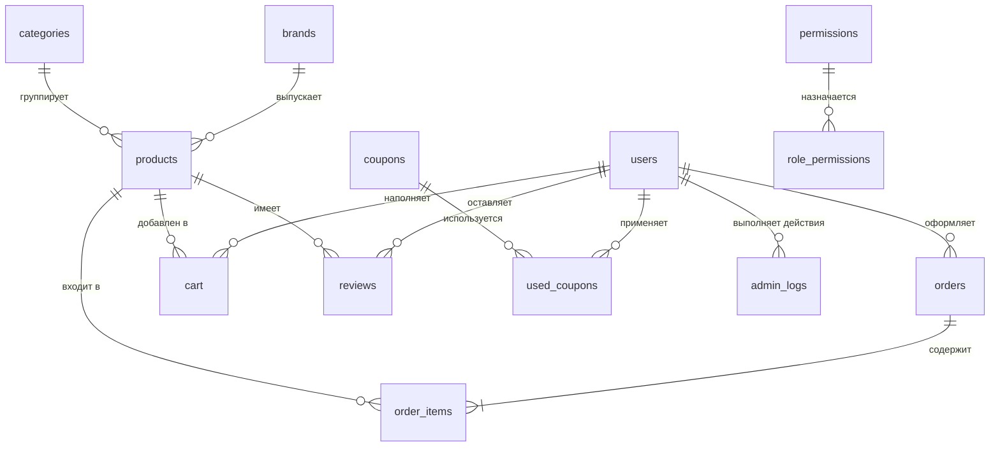

# Интернет-аптека на PHP с ИИ-консультантом на локальной LLM (Ollama + Qwen3)
Проект, разработанный во время преддипломной практики в колледже в качестве дипломного проекта. Проект представляет собой сайт аптеки с ключевыми функциями, требующимися для полноценной работы.


## ИИ-консультант
Покупатель описывает симптом обычными словами, а консультант подбирает препараты из каталога и коротко поясняет способ применения и противопоказания.

Главная сложность была не в том, чтобы прикрутить модель, а в том, чтобы она не выдумывала. Аптека — не то место, где можно порекомендовать препарат, которого не существует. Поэтому модель здесь вообще не является источником данных: она только выбирает названия, а все факты подтягиваются из базы.


Работает это так.

Перед обращением к модели из базы выбирается весь каталог — название, цена, краткое описание, способ применения, состав, противопоказания. Каждое поле обрезается по длине через ```mb_strimwidth```, чтобы промпт не разрастался, и всё склеивается в текстовый список. Этот список подставляется прямо в системную инструкцию:

```php
$systemPrompt = <<<PROMPT
Ты фармацевт-консультант интернет-аптеки. Отвечай только
на русском языке, кратко (2-4 предложения).
Рекомендуй ТОЛЬКО товары из списка ниже, не придумывай
названия, которых в нём нет. Указывай способ применения
и главные противопоказания.
=== ТОВАРЫ В КАТАЛОГЕ ===
{$productList}
=========================
В конце ответа добавь блок строго в формате:
###MEDICINES###
["Точное название 1","Точное название 2"]
###END###
PROMPT;
```

Запрос уходит curl'ом на локальный Ollama (http://localhost:11434/api/chat), модель qwen3:8b, со stream: false и think: false.

В ответе приходит текст рекомендации плюс служебный блок с точными названиями. PHP выдёргивает его регуляркой и вырезает из основного текста, чтобы пользователь не видел разметку. Если модель нарушила формат JSON — есть запасной разбор по кавычкам и маркерам списка.

Дальше по каждому названию идёт второй запрос в базу: сначала точное совпадение, при промахе — LIKE. Оттуда берутся настоящие цена, состав, противопоказания и картинка для карточки.


Итог: обработчик не доверяет тому, что выдала модель, а проверяет каждое название по базе. От модели приходит по сути только навигация по каталогу — всё, что видит пользователь в карточке, приезжает из MySQL.

## Разработка и демонстрация системы
 Главный экран с представленным каталогом и ии-помощником. 

Каталог товаров поддерживает асинхронную подгрузку содержимого без перезагрузки страницы. Обработчик catalog_ajax.php собирает запрос с фильтрами по бренду, цене и поиску, возвращает результат в JSON, а отрисовкой карточек занимается JavaScript. Просмотреть его можно в листинге ниже:

<details>
<summary>Листинг</summary>

```php
<?php
require "../app/bootstrap.php";

$search   = trim($_GET['q'] ?? '');
$sort     = $_GET['sort'] ?? 'new';
$brand    = $_GET['brand'] ?? '';
$priceMin = $_GET['price_min'] ?? '';
$priceMax = $_GET['price_max'] ?? '';

$sql = "SELECT p.id, p.name, p.price, p.image, b.name AS brand_name
        FROM products p LEFT JOIN brands b ON p.brand_id = b.id WHERE 1=1";
$params = [];

if ($search !== '') { $sql .= " AND p.name LIKE ?"; $params[] = "%$search%"; }
if ($brand  !== '') { $sql .= " AND p.brand_id = ?"; $params[] = (int)$brand; }
if ($priceMin !== '') { $sql .= " AND p.price >= ?"; $params[] = (int)$priceMin; }
if ($priceMax !== '') { $sql .= " AND p.price <= ?"; $params[] = (int)$priceMax; }

switch ($sort) {
    case 'price_asc':  $sql .= " ORDER BY p.price ASC"; break;
    case 'price_desc': $sql .= " ORDER BY p.price DESC"; break;
    case 'name_asc':   $sql .= " ORDER BY p.name ASC"; break;
    case 'brand_asc':  $sql .= " ORDER BY brand_name ASC, p.name ASC"; break;
    default:           $sql .= " ORDER BY p.id DESC"; break;
}

$stmt = $pdo->prepare($sql);
$stmt->execute($params);
$products = $stmt->fetchAll(PDO::FETCH_ASSOC);

header('Content-Type: application/json');
echo json_encode($products);
```
В листинге показано, что обработчик получает идентификатор бренда из параметров запроса, выбирает из базы данных соответствующие товары и формирует HTML-разметку карточек. Применение подготовленных запросов и функции htmlspecialchars обеспечивает защиту от внедрения вредоносного кода.
</details>
  
<br>

## Стек и возможности
Серверная часть на PHP, клиентская — HTML, CSS и JavaScript, данные в MySQL. Взаимодействие с базой вынесено в отдельный модуль и построено на PDO с подготовленными запросами. Система состоит из двух частей: общедоступной витрины и закрытой административной панели.

Витрина включает каталог с асинхронной подгрузкой товаров через AJAX — список обновляется без перезагрузки страницы. Реализованы корзина на сессиях, регистрация и авторизация с хешированием паролей, оформление и оплата заказа через ЮKassa, личный кабинет с историей заказов. Адрес доставки выбирается на Яндекс.Картах и подставляется в форму. После оформления заказа покупателю уходит письмо через PHPMailer.

Отдельная страница есть у каждого бренда — логотип, описание, свои товары, рекламный баннер на главной. Всё это правится из админки, доступ к которой открыт только роли «Администратор».

Статус заказа хранится строкой и меняется по мере доставки: `new` → `processing` → `shipped` → `at_hub` → `sent_to_pickup` → `ready_for_pickup`, либо `cancelled`. На странице заказа статус показан трекером с прогресс-баром.

## Запуск
Нужны PHP 8, MySQL и [Ollama](https://ollama.com).
```bash
git clone https://github.com/strashilka2006/pharmacy-ai-assistant.git
cd pharmacy-ai-assistant

composer install

mysql -u root -p -e "CREATE DATABASE apteka CHARACTER SET utf8mb4"
mysql -u root -p apteka < schema.sql

ollama pull qwen3:8b
ollama serve
```
Скопируй `app/config.example.php` в `app/config.php` и впиши свои доступы: MySQL, ключи ЮKassa и SMTP.

Тестовый вход в админку: `admin@apteka.local` / `admin123`

## Что не доделал / Что можно доделать
Проект писался как дипломный, в фиксированные сроки, поэтому часть вещей сознательно упрощена. Ниже — что именно и куда копать, если захочется развить.

Поиска внутри ИИ-модуля нет, поэтому в промпт уходит вся таблица товаров целиком, без WHERE и LIMIT. На объёме каталога в этом проекте работает нормально, но на большом упрётся в размер контекста — надо префильтровать запросом до подстановки в промпт.

Служебный блок с названиями парсится регуляркой, это хрупко: модель может отдать невалидный JSON. У Ollama есть format: json, правильнее было через него.

Количество товара — статическое число в базе, при заказе не списывается.

Истории диалога нет, каждый вопрос обрабатывается отдельно.

Модель ограничена каталогом, но не проверяет уместность рекомендации — например, не отличает рецептурный препарат от безрецептурного при выдаче. Поле prescription в базе для этого есть, фильтр по нему поверх ответа модели — следующий логичный шаг.

Вход через Google и VK был сделан и работал, но обработчики колбэков завязаны на localhost и мои ключи приложений, поэтому у постороннего человека всё равно не заработали бы. Убрал кнопки с форм, оставил вход по email.
Статус оплаты проверяется при возврате пользователя на сайт. Если он закроет вкладку после оплаты, заказ останется в статусе `new`. Правильно делать через вебхуки ЮKassa.

Ограничение частоты запросов к консультанту хранится в сессии, то есть обходится очисткой кук. Для боевого режима нужна привязка к IP.

## Заметки для тех, кто будет разворачивать

Сразу совет по ЮКассе. Её лучше сразу создать через официальный сайт [https://yookassa.ru/]: в панели `Сервисы` → `Тестовый магазин`, создаёте любой тестовый магазин. Сразу оговорка — деньги там не настоящие, понятное дело. Сумма оплаты может быть любой, как и периодичность, на это там не смотрят. Вся информация так же показывается сразу в тестовом магазине (я по незнанию делал отдельный дебагер на оплату, хотя вся информация — пришла оплата или нет — была уже на странице). Потом после создания копируете выданный `shop_id` и секретный ключ и вставляете в `app/config.php` в блок `$yookassa`.

По Google API, VK API и Яндекс.API ситуация такая же, но местами муторная. Тут честно, у Google я сделал API за пару минут, а у ВКонтакте мне пришлось становиться самозанятым бизнес-мейкером (что 😭) и просто у них есть свойство отзывать вам ключи доступа для той же двухфакторной аутентификации.

Так же очень важное уточнение. Я размещал сервер на Beget, и на нём ваша (моя в том числе) локальная ИИ через Ollama просто не запустится, потому что на Beget она не предустановлена, как и сама модель. Так что я на защите использовал API-ключ с [OpenRouter](https://openrouter.ai/).

Советую там выбрать не бесплатную модель, а дешёвую платную уровня Qwen3. Это из-за того, что очень много людей используют этот сайт и бесплатные модели в том числе, и если будет ответственный момент, когда вы станете показывать ИИ, модель спокойно сможет просто отклонить запрос из-за большой нагрузки на неё. Платные модели даже в пару центов за миллион токенов у меня ни разу не отлетали. Это, кстати, и основная причина, почему я развернул локальную ИИ у себя — так банально надёжнее.

## Структура базы данных apteka
СУБД: MariaDB 10.4 (MySQL-совместимая) · Движок: InnoDB · Кодировка: utf8mb4_general_ci Таблиц: 14


> Связи реализованы **логически, на уровне приложения**: в дампе объявлены только `PRIMARY KEY` и обычные индексы (`KEY`), внешние ключи (`FOREIGN KEY`) отсутствуют.

<details>
<summary>Развёрнутые таблицы из бд</summary>

### `users` — пользователи и администраторы

| Колонка | Тип | Описание |
|---|---|---|
| `id` | int, PK, AI | Идентификатор |
| `email` | varchar(255), UNIQUE | Логин пользователя |
| `password` | varchar(255) | Хеш пароля (bcrypt, `$2y$10$…`) |
| `name` | varchar(255), NULL | Имя |
| `phone` | varchar(50), NULL | Телефон |
| `role` | enum(`user`,`admin`) | Роль, по умолчанию `user` |
| `created_at` | timestamp | Дата регистрации |
| `avatar` | varchar(255), NULL | Путь к аватару |
| `address` | varchar(255), NULL | Адрес по умолчанию |

### `products` — товары (лекарства, БАДы, косметика)

| Колонка | Тип | Описание |
|---|---|---|
| `id` | int, PK, AI | Идентификатор |
| `category_id` | int, NULL | Ссылка на `categories.id` |
| `name` | varchar(255) | Название |
| `short_description` | text, NULL | Краткое описание для карточки в каталоге |
| `description` | text, NULL | Основное описание |
| `long_description` | longtext, NULL | Развёрнутое описание для страницы товара |
| `price` | decimal(10,2) | Цена |
| `supplier` | varchar(255), NULL | Поставщик |
| `brand_id` | int, NULL | Ссылка на `brands.id` |
| `brand` | varchar(100), NULL | Текстовое название бренда (устаревшее поле) |
| `prescription` | tinyint(1) | Рецептурный отпуск: `0` / `1` |
| `usage_info` | text, NULL | Способ применения и дозировки |
| `stock` | int | Остаток на складе |
| `image` | varchar(255), NULL | URL или путь к изображению |
| `photo` | varchar(255), NULL | Дополнительное изображение (не используется) |
| `created_at` | timestamp | Дата добавления |
| `label` | varchar(50), NULL | Метка-бейдж: `bad` (БАД), `strong` (сильнодействующее) |
| `indications` | text, NULL | Показания к применению |
| `composition` | text, NULL | Состав |
| `contraindications` | text, NULL | Противопоказания |
| `drug_interactions` | text, NULL | Лекарственное взаимодействие |
| `overdose` | text, NULL | Передозировка |

### `brands` — бренды-производители

| Колонка | Тип | Описание |
|---|---|---|
| `id` | int, PK, AI | Идентификатор |
| `name` | varchar(100), UNIQUE | Название бренда |
| `description` | text, NULL | Описание для страницы бренда |
| `logo` | varchar(255), NULL | Путь к логотипу |
| `banner` | varchar(500), NULL | Путь к баннеру |
| `created_at` | datetime | Дата добавления |

### `categories` — категории товаров

| Колонка | Тип | Описание |
|---|---|---|
| `id` | int, PK, AI | Идентификатор |
| `name` | varchar(255) | Название категории |
| `description` | text, NULL | Описание |

### `cart` — корзина

| Колонка | Тип | Описание |
|---|---|---|
| `id` | int, PK, AI | Идентификатор |
| `user_id` | int | Владелец корзины |
| `product_id` | int | Товар |
| `qty` | int | Количество, по умолчанию `1` |
| `added_at` | timestamp | Время добавления |

Уникальный ключ `uniq_user_product (user_id, product_id)` — один товар в корзине пользователя строго одной строкой.

### `orders` — заказы

| Колонка | Тип | Описание |
|---|---|---|
| `id` | int, PK, AI | Номер заказа |
| `user_id` | int | Покупатель |
| `total` | decimal(10,2) | Итоговая сумма |
| `status` | enum(`pending_payment`,`new`,`paid`,`cancelled`) | Статус, по умолчанию `pending_payment` |
| `name` | varchar(255) | Имя получателя |
| `phone` | varchar(50) | Телефон получателя |
| `address` | text | Адрес доставки |
| `created_at` | datetime | Дата создания |
| `updated_at` | datetime, NULL | Обновляется автоматически |
| `payment_id` | varchar(64), NULL | Идентификатор платежа в платёжной системе |

### `order_items` — позиции заказа

| Колонка | Тип | Описание |
|---|---|---|
| `id` | int, PK, AI | Идентификатор |
| `order_id` | int | Ссылка на `orders.id` |
| `product_id` | int | Ссылка на `products.id` |
| `qty` | int | Количество |
| `price` | decimal(10,2) | Цена на момент покупки (фиксируется, не тянется из `products`) |

### `reviews` — отзывы о товарах

| Колонка | Тип | Описание |
|---|---|---|
| `id` | int, PK, AI | Идентификатор |
| `product_id` | int | Товар |
| `user_id` | int | Автор |
| `rating` | int | Оценка |
| `comment` | text, NULL | Текст отзыва |
| `created_at` | timestamp | Дата публикации |

### `coupons` — промокоды

| Колонка | Тип | Описание |
|---|---|---|
| `id` | int, PK, AI | Идентификатор |
| `code` | varchar(50), UNIQUE | Код купона |
| `discount_percent` | int | Скидка в процентах |
| `expires_at` | datetime, NULL | Срок действия |
| `active` | tinyint(1) | Активен, по умолчанию `1` |

### `used_coupons` — история применения купонов

| Колонка | Тип | Описание |
|---|---|---|
| `id` | int, PK, AI | Идентификатор |
| `user_id` | int | Пользователь |
| `coupon_id` | int | Купон |
| `used_at` | timestamp | Время применения |

### `email_verifications` — подтверждение e-mail

| Колонка | Тип | Описание |
|---|---|---|
| `id` | int, PK, AI | Идентификатор |
| `email` | varchar(255), индекс | Адрес, на который отправлен код |
| `code` | varchar(6) | Шестизначный код подтверждения |
| `created_at` | datetime | Время генерации кода |
| `verified` | tinyint | Флаг подтверждения, по умолчанию `0` |

### `permissions` — права доступа

| Колонка | Тип | Описание |
|---|---|---|
| `id` | int, PK, AI | Идентификатор |
| `name` | varchar(255), UNIQUE | Кодовое имя права |

Предустановленные значения: `manage_products`, `manage_users`, `view_admin_panel`.

### `role_permissions` — привязка прав к ролям

| Колонка | Тип | Описание |
|---|---|---|
| `role` | enum(`admin`,`user`) | Роль |
| `permission_id` | int | Ссылка на `permissions.id` |

По умолчанию все три права выданы роли `admin`. Собственного первичного ключа у таблицы нет.

### `admin_logs` — журнал действий администратора

| Колонка | Тип | Описание |
|---|---|---|
| `id` | int, PK, AI | Идентификатор |
| `admin_id` | int | Кто выполнил действие (`users.id`) |
| `action` | text | Описание действия |
| `created_at` | timestamp | Время события |
</details>

> Импорт
```bash
mysql -u root -p -e "CREATE DATABASE apteka CHARACTER SET utf8mb4 COLLATE utf8mb4_general_ci;"
mysql -u root -p apteka < apteka.sql
```

<details>
<summary>Структура проекта</summary>
  
Исходный код информационной системы организован по функциональному принципу с разделением общедоступной части (витрины), служебной логики приложения и закрытой административной части. Такое разделение упрощает сопровождение системы и исключает дублирование кода. Структура каталогов проекта приведена далее.
```text
apteka/
├── app/                             инициализация и общая логика
│   ├── bootstrap.php                запуск сессии и подключений
│   ├── config.example.php           образец конфига (копируется в config.php)
│   └── functions.php                вспомогательные функции, CSRF, проверка прав
├── css/
│   ├── hero.png                     фоновое изображение главной
│   └── style.css                    стили
├── public/                          общедоступная часть (витрина)
│   ├── admin/                       административная панель
│   │   ├── index.php                сводная страница
│   │   ├── products.php             список товаров
│   │   ├── product_add.php          добавление товара
│   │   ├── product_edit.php         редактирование товара
│   │   ├── product_delete.php       удаление товара
│   │   ├── brands.php               список брендов
│   │   ├── brand_edit.php           редактирование бренда
│   │   └── layout/
│   │       ├── admin_header.php     шапка админки
│   │       └── admin_footer.php     подвал админки
│   ├── layout/
│   │   ├── header.php               шапка витрины
│   │   └── footer.php               подвал витрины
│   ├── uploads/                     изображения
│   ├── add_to_cart.php              добавление товара в корзину
│   ├── ajax_qty.php                 пересчёт корзины через AJAX
│   ├── brand.php                    страница бренда
│   ├── cart.php                     корзина и оформление заказа
│   ├── catalog_ajax.php             AJAX-обработчик каталога, отдаёт JSON
│   ├── chat_api.php                 обработчик AI-консультанта
│   ├── index.php                    главная страница и каталог
│   ├── login.php                    вход
│   ├── logout.php                   выход
│   ├── order.php                    оформление заказа
│   ├── order_cancel.php             отмена заказа
│   ├── order_success.php            успешное оформление
│   ├── order_view.php               просмотр заказа и трекер доставки
│   ├── payment_pending.php          ожидание оплаты
│   ├── payment_return.php           возврат после оплаты
│   ├── personal.php                 личный кабинет покупателя
│   ├── privacy.php                  политика конфиденциальности
│   ├── product.php                  страница товара
│   ├── qty_minus.php                уменьшение количества
│   ├── qty_plus.php                 увеличение количества
│   ├── register.php                 регистрация с подтверждением по коду
│   └── remove_from_cart.php         удаление товара из корзины
├── uploads/                         изображения товаров
│   └── brands/                      логотипы и баннеры брендов
├── .gitignore
├── LICENSE
├── README.md
├── composer.json                    зависимости проекта
├── composer.lock                    зафиксированные версии (PHPMailer)
└── schema.sql                       дамп базы данных
```
</details>

Если будешь смотреть код: начинать логичнее с public/chat_api.php — там вся логика ИИ-консультанта. Остальное обычный интернет-магазин.
